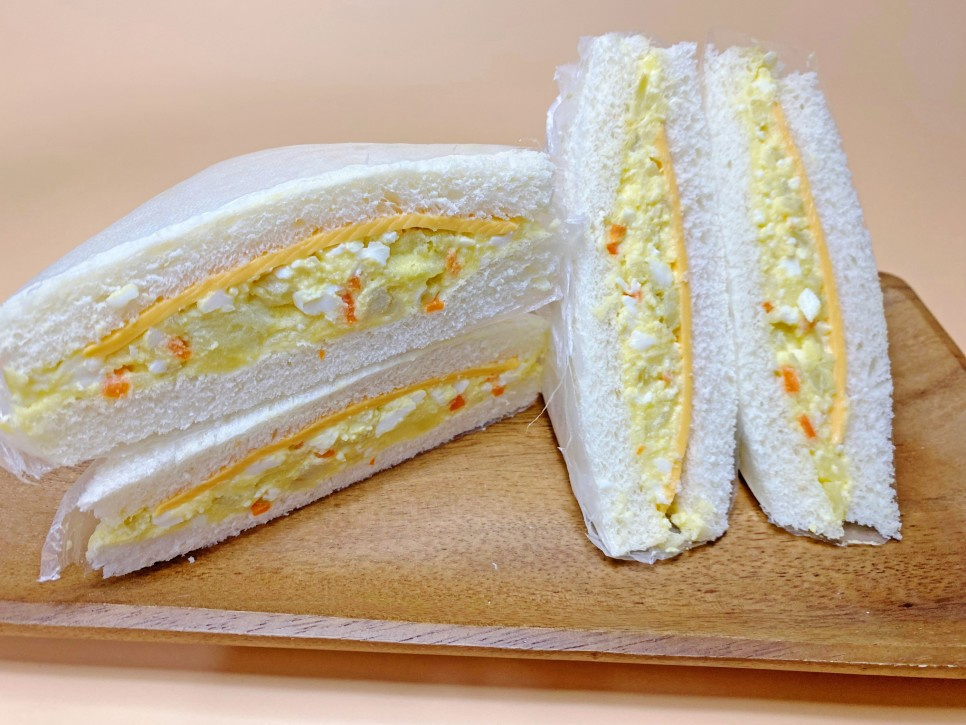

# Egg-Potato Sandwich Recipe

## Description
### **This is the BEST and the EASIEST recipe to make an 'Egg-Potato Sandwich' You can make this anytime you want!**

### Ingredients

- a plain bread - 4piece
- Cheddar cheese - 2piece
- Eggs - 2ea
- Potato - 1ea
- Vegitable pickle
- Carrot
- Salt
- Mayonnaise
- Vinegar

### Instructions (12 steps)

1. Put water in a pot and boil it first.
When the water boils, add eggs and a teaspoon of salt and a tablespoon of vinegar.
And cook on medium heat for 12 minutes.
2. When the egg is done, soak it in cold water for a while and peel it.
3. Peel the potatoes and slice them.
The weight of the skin came out to be 150g.
And put it in a microwaveable container, wrap it with a microwaveable lid or wrap, and microwave it for 4 to 5 minutes.
4. Please cut the carrots and pickles into small pieces and prepare them in advance.
5. Mash potatoes directly with a fork while they are hot.
6. Mash the eggs with a fork, too.
7. Add mashed potatoes, chopped carrots and pickles to eggs and add 1 teaspoon of salt and mix first.
8. Now add 2 tablespoons of mayonnaise and mix well.
9. Now prepare 4 slices of bread.
Place cheddar cheese on two slices of bread first.
10. Add half the egg potato salad you made on top of it.
11. The edges of the bread were a little stiff, so I covered the bread and cut the edges.(Optional)
12. And please wrap it tightly so that it doesn't leak.
Cut the packaged sandwich in half to make it easy to eat.